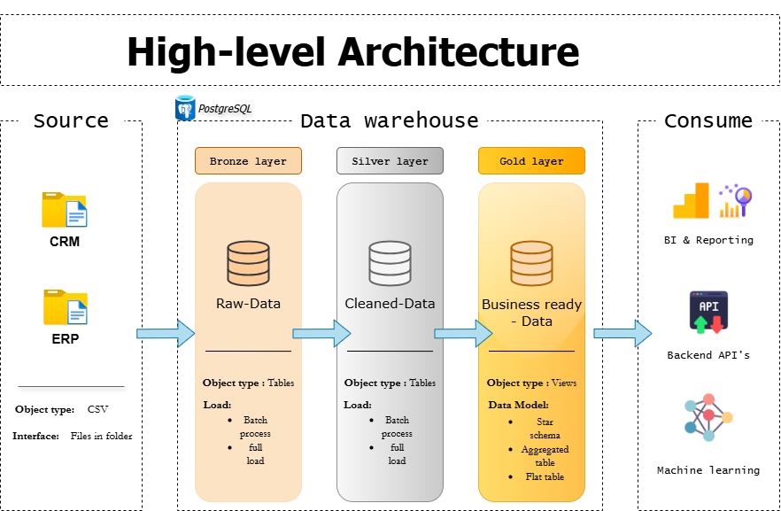

# Data Warehouse and Analytics Project

This project demonstrates a comprehensive data warehousing and analytics solution, from building a data warehouse to generating actionable insights. Designed as a portfolio project, it highlights industry best practices in data engineering and analytics.

---

## 🏗️ Data Architecture

The data architecture for this project follows Medallion Architecture **Bronze**, **Silver**, and **Gold** layers:


1. **Bronze Layer**: Stores raw data as-is from the source systems. Data is ingested from CSV Files into PostgreSQL database.
2. **Silver Layer**: This layer includes data cleansing, standardization, and normalization processes to prepare data for analysis.
3. **Gold Layer**: Houses business-ready data modeled into a star schema required for reporting and analytics.

---

## 📖 Project Overview

This project involves:

1. **Data Architecture**: Designing a Modern Data Warehouse Using Medallion Architecture **Bronze**, **Silver**, and **Gold** layers.
2. **ETL Pipelines**: Extracting, transforming, and loading data from source systems into the warehouse.
3. **Data Modeling**: Developing fact and dimension tables optimized for analytical queries.
4. **Analytics & Reporting**: Creating SQL-based reports and dashboards for actionable insights.

🎯 This project has been a valuable learning experience where I developed hands-on skills in:

- SQL Development
- Data Architect
- Data Engineering
- ETL Pipeline Developement
- Data Modeling
- Data Analytics

---

## 🚀 Technical Requirements

### Prerequisites

- PostgreSQL 17
- Source data in CSV format

### Building the Data Warehouse

#### Objective

Develop a modern data warehouse using PostgreSQL to consolidate sales data from ERP and CRM systems, enabling analytical reporting and informed decision-making.

#### Specifications

- **Data Sources**: Import data from ERP and CRM systems provided as CSV files
- **Data Quality**: Quality checks implemented at each layer as documented in scripts
- **Integration**: Consolidated data model optimized for analytical queries
- **Documentation**: Comprehensive documentation provided in script headers and data catalog
- **Execution Flow**: Scripts must be run in order (init_db → bronze → silver → gold)

---

### Implementation Details

Each script in the project contains detailed headers documenting:

- Purpose and functionality
- Dependencies and prerequisites
- Execution requirements
- Error handling approach
- Quality checks and validations
- Change history

For layer-specific implementation details, refer to the headers in individual scripts.

## 📂 Repository Structure

```
sql-data-warehouse/
│
├── datasets/                           # Raw datasets from source systems
│   ├── source_crm/                     # Customer and sales data
│   │   ├── cust_info.csv
│   │   ├── prd_info.csv
│   │   └── sales_details.csv
│   └── source_erp/                     # Location and product data
│       ├── CUST_AZ12.csv
│       ├── LOC_A101.csv
│       └── PX_CAT_G1V2.csv
│
├── docs/                              # Project documentation
│
├── scripts/                           # SQL scripts for ETL and transformations
│   ├── init_db.sql                    # Database initialization script
│   ├── bronze/                        # Bronze layer: Raw data ingestion
│   ├── silver/                        # Silver layer: Data cleansing & standardization
│   ├── gold/                          # Gold layer: Analytics-ready models
│   └── test/                          # Data quality and validation tests
│
└── README.md                          # Project overview and documentation
```

---

## ☕ Stay Connected

Let's stay in touch! Feel free to connect with me on the following platforms:
[](https://linkedin.com/in/braneshp24)
[](https://braneshp24.netlify.app/)
